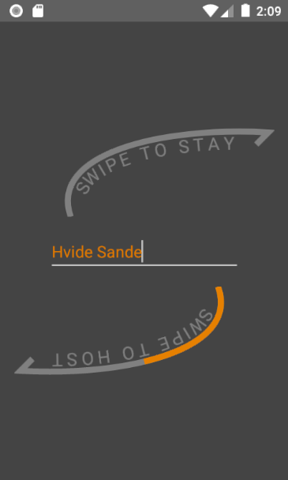

# Surf & Stay

Bestimmte Ferienorte entlang von Küsten werden häufig von spontanen, kurzentschlossenen Surfern besucht, die täglich dem Wind hinterher ziehen. Das Miteinander in diesen Kreisen ist sehr offen, kontaktfreudig und unkompliziert. Diesem Umstand soll entlang des Rejkobing Fjords in Dänemark eine App entgegenkommen, die es den Vermietern dieser Region erlaubt, Surfern spontane und unkonventionelle Kurzaufenthalte anzubieten. Auch Surfer können spontane Übernachtungen (etwa in ihren Bussen) anderen Surfern anbieten. Diese Angebote können dann gesucht und gebucht werden.

Ihre Aufgabe besteht darin, einen Teil des Prototyps der App **Surf-n-Stay** für Android als Client-Server-Architektur zu entwickeln.

{ height="500" style="display: block; margin: 0 auto" }

## User Stories

Als Benutzer möchte ich möglichst viele Wischgesten als Interaktion, damit sich das Erlebnis modern und mobile-first anfühlt

### Als Anbieter möchte ich ...

- ein Übernachtungsangebot an meinen aktuellen Standort erstellen können, sodass ich keine Adresse eintippen muss
- ein Übernachtungsangebot für eine manuell eingegebene Adresse erstellen
- für ein bereits angelegtes Übernachtungsangebot folgende Hauptdaten konfigurieren können: Adresse, Preis, Anzahl der Betten, An- & Abreisedatum
- den Preis eines Übernachtungsangebots auch  nicht-monitär gestalten können, um der Surferkultur in ihrem Freiheitsbedürfnis entgegenkommen zu können
- für ein Übernachtungsangebot folgende Optionen konfigurieren können: Sauna, Kamin, Raucher, Haustiere, Internet
- ein Übernachtungsangebot publizieren/veröffentlichen können, sodass Surfer es finden
- ein Übernachtungsangebot "unpublishen" können, damit Surfer es nicht mehr finden
- ein Übernachtungsangebot duplizieren können, sodass ich Konfigurationsarbeit einspare, wenn sich Angebote ähneln
- ein Übernachtungsangebot löschen können, sodass es auch für mich nicht mehr sichtbar und mein Gesamtangebot aufgeräumt ist
- meine Übernachtungsangebote nach Veröffentlichungs-Status filtern können, sodass ich eine schnelle Übersicht darüber habe, was online auffindbar ist

### Als Surfer auf der Suche nach einem Übernachtungsplatz möchte ich ...

- Übernachtungsangebote in der Nähe meines aktuellen Standorts finden können, sodass ich nicht den Namen einer Stadt tippen muss, den ich nicht aussprechen kann und für dessen Zeichensatz ich kein passendes Tastaturlayout installiert habe
- Übernachtungsangebote in der Nähe einer manuell angegebenen Adresse finden können
- nur Angebote mit dem Startdatum "heute" und maximal 7 Tage in die Zukunft sehen
- einen Entfernungsradius in km einstellen können, damit ich es nach dem Surfen nicht zu weit zur Sauna, zum Kamin etc. habe
- pro Angebot auf einen Blick sehen, was die Kosten sind, wie die Ausstattung ist, wie weit es vom Standort entfernt ist und wann das frühste Anreisedatum ist

## Technische Entscheidungen

- Die Kommunikation zwischn Server & Client soll via **JSON** nach dem **REST-Prinzip** passieren
- Als Datenbank wird **SQLITE** verwendet, damit wir einen möglichst schlanken Techstack haben
- Der Server wird in **Java** geschrieben
- Die Struktur der App folgt **grob** den folgenden drei Mockups und verwaltet die Angebote clientseitig als Liste(n):

# Abgabe

Bitte packt folgende Artefakte in eine gemeinsame ZIP-Datei, benennt sie nach dem Schema **Surf_n_Stay-<Nachname_1\>-<Nachname_2\>-<Nachname_3\>.zip** und reicht sie per Teamsaufgabe ein:

- Diagramm (**ER**) des Datenbankschemas als Bild (svg, png, ...)
- **Screencapture**-Video der App in Aktion. Hier soll gezeigt werden, dass Anbieter Übernachtungsangebote erstellen und filtern können, während Suchende zu einem Standort eine Liste mit entsprechenden Angeboten gezeigt bekommen.
- Gesamter **Projektcode** (Server & Client)
- `README.md` mit Angaben zur **Arbeitsteilung** und zur **Inbetriebnahme** der App (Server und Client)

# Bewertungsschema

**SERVER - [40%]**

- Datenbank kann erstellt und angebunden werden
- Kann Anfragen zur Erstellung von Übernachtungsangeboten verarbeiten & persistent in der DB speichern
- Kann Anfragen zur Änderungen eines Übernachtungsangebotes korrekt verarbeiten
- Kann Übernachtungsanfragen korrekt verarbeiten

**CLIENT - [50%]**

- Client erlaubt Angebotserstellung aus GPS-Daten und aus manueller Eingabe einer Adresse
- Im Client funktioniert die filterbare Listendarstellung der eigenen Angebote
- Ein konkretes Angebot ist entsprechend den Userstories im Client editierbar
- Im Client funktionieren für ein konkretes Angebot alle geforderten Lifecycle-Operationen
- Die Listendarstellung von Angeboten in der Nähe einer GPS-Koordinate oder einer manuell angegebenen Adresse funktioniert korrekt

**PRETTY-POINTS - [10%]**

- Vollständigkeit der Abgabe
- Fristgerechte Abgabe
- Fachgerechte Strukturierung & Benennung der DB- und der Code-Bestandteile
- Fachgerecht gestaltetes Netzwerkprotokoll
- UX Design

# ANHANG

## Wichtige Recherchethemen

- ListView & Adapter
- Custom Layout & Drawables für Listeneinträge
- HTTP Client-Server Kommunikation
- Die Klasse Path für benutzerdefinierte Kurven/Linien
- SQLite Anbindung

## Minimaler Java Http-Server

```java
import com.sun.net.httpserver.HttpExchange;
import com.sun.net.httpserver.HttpServer;

import java.io.IOException;
import java.io.OutputStream;
import java.net.InetSocketAddress;
import java.nio.charset.StandardCharsets;

public class MinimalServer {

    public static void main(String[] args) throws IOException {
        int port = 8080;

        HttpServer server = HttpServer.create(new InetSocketAddress(port), 0);

        server.createContext("/health", MinimalServer::handleHealth);

        // Optional: Standard-Executor (simple) verwenden
        server.setExecutor(null);

        server.start();
        System.out.println("Server läuft auf http://localhost:" + port);
    }

    private static void handleHealth(HttpExchange exchange) throws IOException {
        // REST-typisch: nur GET erlauben (optional, aber sauber)
        if (!"GET".equalsIgnoreCase(exchange.getRequestMethod())) {
            exchange.sendResponseHeaders(405, -1); // Method Not Allowed, kein Body
            exchange.close();
            return;
        }

        byte[] body = "OK".getBytes(StandardCharsets.UTF_8);

        exchange.getResponseHeaders().set("Content-Type", "text/plain; charset=utf-8");
        exchange.sendResponseHeaders(200, body.length);

        try (OutputStream os = exchange.getResponseBody()) {
            os.write(body);
        }
    }
}
```
